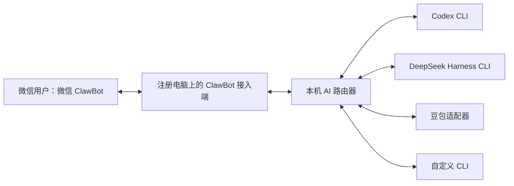

# 微信 ClawBot 本机 AI 路由器

在微信里发任务，由注册电脑上的接入端调用本机路由器，再交给可用的 AI CLI 执行并返回结果。目标平台为 macOS 和 Windows；路由器不直接调用 AI 厂商模型 API。

## 快速开始

macOS 用户按 [十分钟快速安装](docs/QUICKSTART.md) 操作即可完成：克隆项目、生成本机配置、链接 OpenClaw、扫码绑定微信和发送首条任务。配置文件会自动填入本机路径，不需要复制作者电脑的目录。

```sh
git clone https://github.com/BH4GXXX/wechat-clawbot-ai-router.git
cd wechat-clawbot-ai-router
npm run openclaw-config
```

项目不保存 AI 账号密码、API Key、微信二维码或登录令牌；`config.json`、`*.local.json5`、运行状态和日志默认不会提交到 Git。

接入微信有两条路线：

| 路线 | 说明 | 文档 |
| --- | --- | --- |
| **OpenClaw 直连（推荐）** | 路由器注册成 OpenClaw 的模型后端，微信消息直达本机 AI，**中间没有模型参与** | [微信 ClawBot 接入](docs/CLAWBOT.md) |
| WorkBuddy 远程通道 + 技能 | 复用 WorkBuddy 已绑定的 ClawBot，链路已打通，但每条消息会先经过助手模型 | [WorkBuddy 接入说明](docs/WORKBUDDY.md) |

当前这台 Mac 已完成两种接入的安装。OpenClaw 2026.9.8 已加载本项目插件，腾讯官方微信插件已扫码绑定，Gateway 已作为 macOS 登录服务运行。2026-10-03 已完成真实手机往返：微信消息进入 OpenClaw，经本机路由器调用 Codex CLI 返回 `WECHAT_ROUTE_OK`，微信插件确认回复发送成功。

## 在微信里切换 AI

切换只改变当前微信会话的首选 AI；该 AI 不可用时仍按可用性优先策略继续其他工具。斜杠命令由插件直接处理，不调用任何 AI：

```text
/route status       查看当前路由和可用 AI
/route codex        首选 Codex
/route deepseek     首选 DeepSeek
/route workbuddy    首选 WorkBuddy
/route doubao       首选豆包
/route auto         恢复配置中的自动顺序
```

也可以直接说“切换到 Codex”“改用 DeepSeek”“使用 WorkBuddy”“请切换到豆包”或“恢复自动路由”。路由偏好按会话保存，Gateway 重启后仍然有效。

### WorkBuddy 接入现状

保留 WorkBuddy 当前的微信 ClawBot 绑定，在 WorkBuddy 中启用 `local-ai-router` 技能；技能把请求交给本机路由器，路由器再按优先级调用 Codex、DeepSeek Harness 或豆包，并把结果交回当前 WorkBuddy 对话。DeepSeek 和豆包的实际验证由用户在 WorkBuddy 中完成，记录见 [WorkBuddy 接入说明](docs/WORKBUDDY.md)。该路径不需要另绑一个 ClawBot，但每条消息仍会先经过 WorkBuddy 助手模型；如果 WorkBuddy 自身不可用，技能也无法启动。

## 运行

需要 Node.js 22+，路由核心无需安装第三方依赖。在本目录执行：

```sh
node cli.mjs init
node cli.mjs doctor
node cli.mjs run --prompt "概述当前工作目录" --session my-chat --id message-001
```

Mac 可双击 `start.command`，Windows 可双击 `start.bat` 创建配置并检查环境。AI CLI 需在本机安装并登录。

[十分钟快速安装](docs/QUICKSTART.md)适合首次部署；[完整中文安装配置步骤](docs/INSTALLATION.md)记录各工具安装、OpenClaw、扫码绑定和验收；[中文使用说明](docs/USAGE.md)包含路由切换、任务去重、会话与故障恢复。配置字段和预设示例见 [config.example.json](config.example.json)。

## 当前实现

- Codex JSONL 与 Claude Code stream-json 适配；当前 Mac 已接入 DeepSeek Harness、WorkBuddy CLI 和豆包适配器。
- 优先级选择、命令发现、额度或服务故障冷却、受控切换。
- 任务 ID 去重、重复结果回放、会话隔离和最近对话持久化。
- 超时与取消、进程终止、并发互斥、输出大小限制；当前采用可用性优先，任一 AI 未成功返回就继续下一个。
- `/route` 与自然语言会话级路由切换；首选工具故障时继续自动接管。
- `init` / `doctor` / `status` / `run` 独立命令入口；`check-tools` 工具体检。
- OpenClaw 插件入口，以及供其他 ClawBot 接入端调用的 stdin/stdout JSON 契约。
- 原生任务留痕：被选中的 Codex、DeepSeek Harness、WorkBuddy 或豆包会保存自己的会话；路由结果同时记录可取得的原生任务 ID。



## 工具体检

```sh
npm run check-tools      # 只体检配置与命令，不调用 AI
npm run check-live       # 逐工具真实探测，报告「可用 / 不可用」
npm run check-failover   # 在真实工具前插入模拟故障，验证会自动切换
```

## 验证与边界

macOS 上已通过本地模拟子进程测试覆盖故障切换、取消、超时、去重、会话隔离、原生任务映射和真实命令入口，测试不调用云端 AI。

2026-10-03 在本机完成了真实验证：Codex 与 DeepSeek Harness 的只读真实调用；WorkBuddy CLI 登录后以禁用工具模式返回 `WORKBUDDY_OK`；
豆包经 `doubao-cli` 的 CDP 通道真实发消息并取回回复；以及**真实发生的故障切换**——
当日 Codex 撞上用量上限，路由器判定为不可用并自动切到 DeepSeek。逐项结果见
[工具可用 / 不可用 与故障切换](docs/FAILOVER.md)。

OpenClaw Gateway、微信账号绑定、微信长轮询通道以及“手机微信 → 本机路由器 → Codex → 手机微信”已经完成端到端验证。Claude Code 和 Windows 进程管理尚未完成实机验证。

桌面 GUI 客户端、ACP 长驻进程、微信附件和图形配置界面尚未实现。此版本不能描述为“任意 AI 客户端均已支持”。电脑离线或所有工具不可用时会报告失败，不保证永远在线。

AI 工具仍可能联网；登录与额度由各工具自身管理。默认 `failoverPolicy: "availability-first"`：断网、额度不足、登录失效、普通失败、权限阻塞、输出异常、超时或状态不确定都会继续下一个 AI，只有用户主动取消才停止。这个策略优先保证微信任务有工具可接管，也意味着前一个 AI 已执行部分操作时可能发生重复执行。需要防重时可改为 `safe`。

## 开发

```sh
npm test                 # 全套 49 项
npm run verify           # 本地验证记录
```

工程入口：`lib/config.mjs`（配置/命令发现）、`lib/process.mjs`（子进程/结果解析）、`lib/engine.mjs`（状态/去重/路由）、`cli.mjs`（独立入口）、`index.mjs` 和 `router.mjs`（OpenClaw 入口）。

[项目大纲](PROJECT_PLAN.md)、[贡献指南](CONTRIBUTING.md)、[后续任务](docs/TASKS.md)保留为设计资料。参考项目：[WeClaw](https://github.com/fastclaw-ai/weclaw)、[CLI-WeChat-Bridge](https://github.com/UNLINEARITY/CLI-WeChat-Bridge)。
